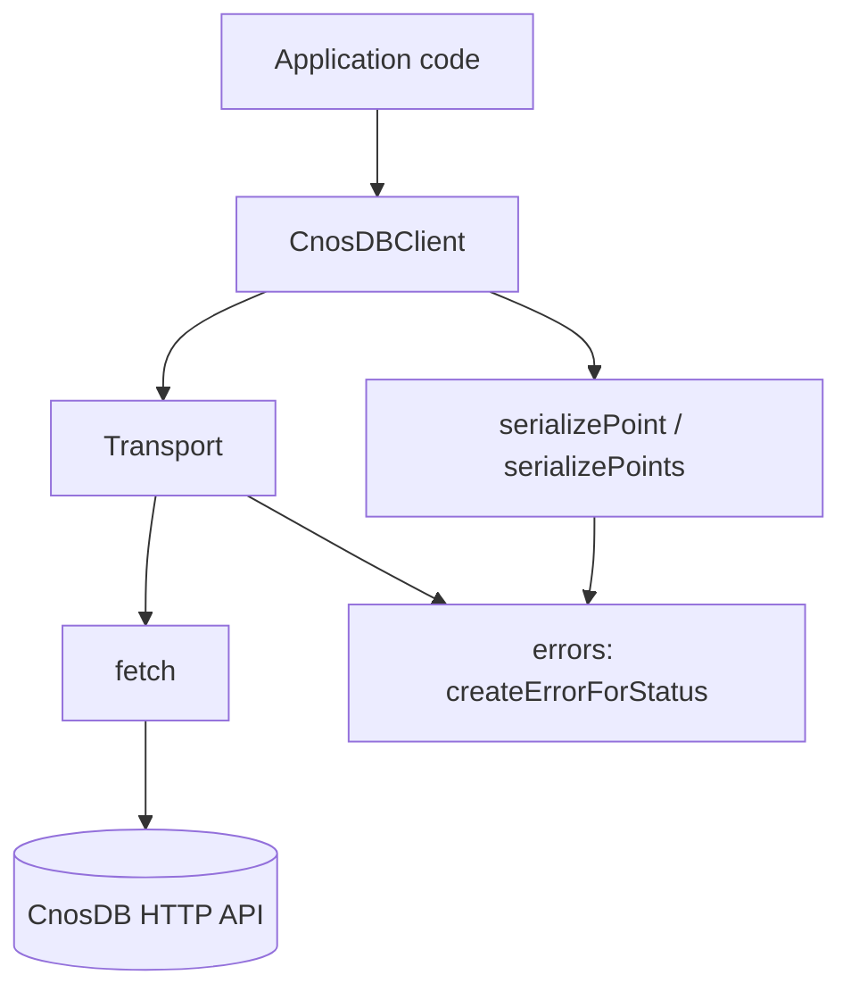
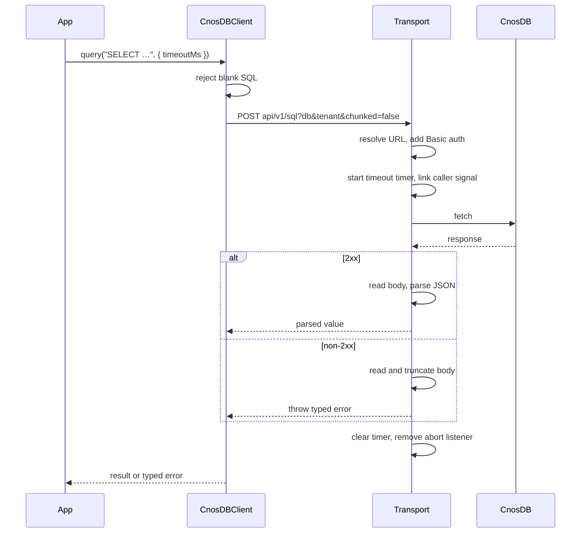
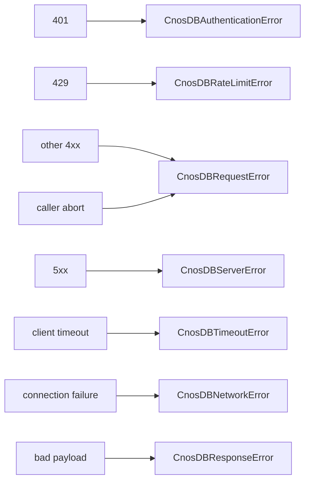

# Architecture

`cnosdb-client` is deliberately small: five source modules, no runtime
dependencies, and one public class. This document explains how the pieces fit
together and why the boundaries are where they are.

## Modules

| Module                 | Responsibility                                              | Public? |
| ---------------------- | ----------------------------------------------------------- | ------- |
| `src/types.ts`         | Public type definitions and TSDoc                           | Yes     |
| `src/errors.ts`        | Error classes and status-to-error mapping                   | Yes     |
| `src/line-protocol.ts` | Pure Line Protocol serialization                            | Partly  |
| `src/http.ts`          | Internal transport: URLs, auth, timeouts, response handling | No      |
| `src/client.ts`        | `CnosDBClient`, thin orchestration over the two below       | Yes     |
| `src/index.ts`         | The package's entire public surface                         | Yes     |

`src/index.ts` re-exports named symbols only. There is no wildcard export, so
internal helpers such as `Transport` and `normalizeBaseUrl` cannot leak into the
public API by accident. The package smoke test asserts this against the built
tarball.

From `line-protocol.ts` only `serializePoint` is public; `serializePoints`,
which joins a batch, is internal.

## Layering

Dependencies point in one direction. The client knows about the transport and
the serializer; neither knows about the client. The serializer touches nothing
but its input, which is why it can be a pure exported function.

## Request flow

Every method funnels into one `Transport.request` implementation, so there is
exactly one place where URLs, headers, timeouts, and status mapping are decided.

Endpoint paths are always relative (`api/v1/sql`, not `/api/v1/sql`) and the
normalized base URL always ends in `/`. That combination is what lets a base
path like `https://example.com/cnosdb` survive URL resolution; a leading slash
would silently discard it.

## Serialization flow

`serializePoint` is pure, deterministic, and network-free:

1. Validate the measurement and reject unrepresentable characters.
2. Sort tag keys, validate each pair, and escape commas, spaces, and equals signs.
3. Sort field keys and encode each value by type: quoted-and-escaped strings, lowercase booleans, plain floats for `number`, and an `i`-suffixed integer for `bigint`.
4. Convert the timestamp to the effective precision, using `bigint` multiplication so nanoseconds never lose precision.

Sorting is what makes the output deterministic: two points with the same content
in a different key order produce byte-identical lines, which makes tests
reliable and diffs meaningful.

`writePoints` serializes the whole batch **before** issuing any request, so an
invalid point at index 7 fails the call without writing points 0 through 6.

## Error flow

All failures become one of eight classes, all extending `CnosDBError`:

Two distinctions matter and are covered by tests. A caller abort is reported as
`CnosDBRequestError` with `code === "ABORT_ERR"`, never as a timeout, because
"you cancelled this" and "the server was too slow" call for different handling.
A failure to reach the server is a `CnosDBNetworkError`, not a request error,
because the request never happened.

## Public and private boundaries

The transport is internal on purpose. Exposing it would freeze URL construction,
header handling, and timeout semantics into the public API and make the
streaming and retry work on the roadmap a breaking change. Internal modules stay
changeable; only what `src/index.ts` exports is a promise.

## Design decisions

Each of these has an ADR in [adr/](adr/):

- The HTTP API, not a wire protocol ([0001](adr/0001-use-cnosdb-http-api.md)).
- Native `fetch`, injectable for tests ([0002](adr/0002-use-native-fetch.md)).
- Dual ESM and CommonJS output ([0003](adr/0003-publish-esm-and-commonjs.md)).
- Changesets for releases ([0004](adr/0004-use-changesets.md)).
- Issue-first GitHub Flow ([0005](adr/0005-use-issue-first-github-flow.md)).
- No automatic retries ([0006](adr/0006-disable-automatic-retries-in-v0.1.0.md)).
- Unofficial, independent branding ([0007](adr/0007-use-unofficial-independent-branding.md)).

### Why no retries

A retry is a correctness decision, not a convenience. `POST /api/v1/write` is
not safely idempotent from the client's point of view: a timeout may mean the
write never landed, or that it landed and the response was lost. Retrying
silently duplicates data in the second case. So v0.1.0 retries nothing and
instead exposes typed errors precise enough for the caller to decide.

### Dependency policy

Runtime dependencies are zero, and adding one requires an ADR. Every dependency
in a client library becomes a dependency of every consuming service, along with
its supply-chain risk and its version conflicts. Development dependencies are
held to a lower bar since they never reach the published artifact.

## Security considerations

The design keeps credentials in exactly one place: the `Authorization` header
built once at construction. They are never written into a URL, an error, or a
log, and the client does not log at all. Errors carry only status, method, path,
and a response body truncated to 64 KiB. Requests are always bounded by a
timeout. Together these mean neither a hostile server nor a stack trace in an
application's log aggregator can reveal the password.
